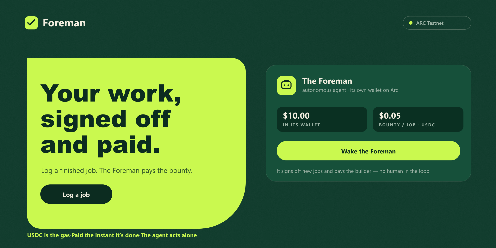

  

# Foreman

*Finish the job. The Foreman signs it off and pays you — no human in the loop.*

**→ [foreman-arc.vercel.app](https://foreman-arc.vercel.app)** · ARC Testnet

---

Foreman is a work log for tradespeople where an **autonomous agent does the paperwork**. You log a
finished job — before/after photos, what you did, where — and it lands on-chain as a timestamped,
tamper-proof record. Then the **Foreman**, an agent with its own wallet on Arc, reviews the board,
signs the job off, and pays you a USDC bounty straight from its wallet. Machine to person, settled in
seconds, no invoice to chase.

Visitors can endorse your work in USDC, and you can keep a job unlisted. It's built on exactly what Arc
is for — USDC is the native gas, settlement is instant, and (Circle's whole bet) the next payer is
software, not a person.

## How it runs

| Who | On-chain |
| --- | --- |
| **You** | `logJob(...)` — before/after photos + details, written on-chain |
| **The Foreman** | `signOff(id)` — pays you a USDC bounty from its own wallet |
| **Anyone** | `endorse(id)` — vouch for a job by sending you USDC |

The Foreman is a small serverless service (`/api/agent/run`) holding its own funded Arc wallet. It
wakes after a new job is logged — or on the "Wake the Foreman" button — and signs off pending jobs,
paying each bounty autonomously.

## Why Arc

- **USDC is the gas** — so an agent can hold a wallet and pay sub-cent bounties with no separate gas token.
- **Instant** — sign-off settles with sub-second finality; the bounty is in your wallet before you've packed up.
- **Agentic** — the Foreman decides and pays on its own. Machine-to-machine commerce is the reason Arc exists.

## Stack

Next.js · ethers v6 · one Solidity contract (verified) · Vercel Blob for the photos · the agent on a
serverless route with its own keys.

Contract
[`0x9aFb21905f694eb4133B96c3e5714C3f5085b165`](https://testnet.arcscan.app/address/0x9aFb21905f694eb4133B96c3e5714C3f5085b165)
— verified on ARC Testnet (chain `5042002`).
